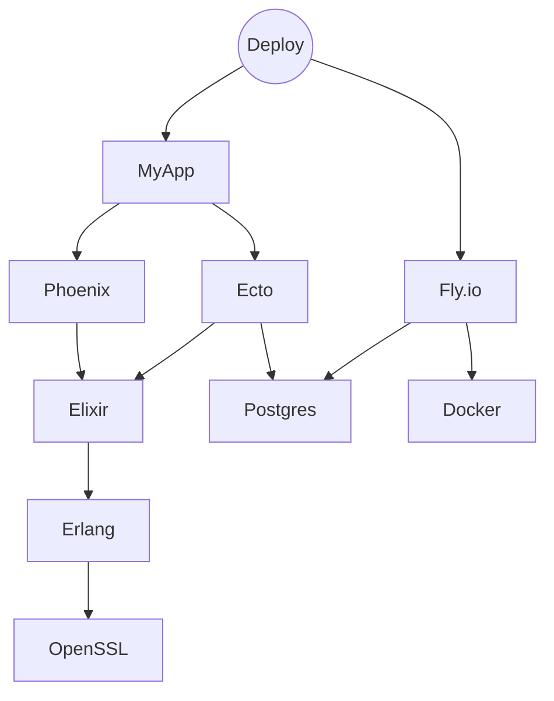

# Welcome to Warp! 🖖

warp is a **wholistic build system** that helps you ship software faster
than ever by giving you instant feedback, shared with your team, and
making sure that every task is only done once and as fast as
possible with fully managed toolchains.

You can use warp to ensure every commit passes all your tests very
cheaply, to improve CI feedback times, and to have a common workflow
across every system and developer on your entire organization.

warp works by analyzing your code, and automatically maintaining a build graph that it optimizes to make sure only the bare minimum work is done on every command.

It then executes these commands locally or remotely, to give you the fastest build, tests, and linting times possible.

## What is a wholistic build system?

Normally your build tools are specialized for a subset of all the tasks you want to achieve:

* Some tools install system-level dependencies, like `brew`, `nix`, or `pacman`
* Some tools install language-level dependencies, like `yarn`, `mix`, or `pip`
* Some tools operate within the scope of a specific project, like `mix format` or `yarn run prettier -w`
* Some tools orchestrate higher level flows that use all the tools from above, like `make deploy` or bash scripts like `./scripts/deploy-assets-to-s3.sh`

Warp considers everything you need to ship your application as a dependency to it, and handles all of these tools in a single graph.

Take for example, an Elixir application written using Elixir 1.14, with the Phoenix framework, expecting a Postgres 11 database. The application is deployed using Docker to Fly.io.

An approximation of Warp's build graph for this application will look like this:

This lets warp figure out what needs to be rebuilt or re-executed,
and what things have already been done and can be retrieved from a
cache.

## warp provides a more reliable software lifecycle

* No longer figure out what the difference between your and mine machine are – we all run all our commands with the same version of every tool

* Save developer and CI time by never rerunning anything twice – our collaborative caching lets everyone in the team benefit from the test results and build artifacts created on CI runs or on other teammates computers

* Ensure a uniform developer flow – warp is so fast that running it as a git precommit hook is even recommended; it helps ensure all the code is formatted, linted, built, and tested correctly on every commit. This is ideal for Trunk-based Development!

# How do I get started?

We welcome you to <a href="https://warp.build/discord">join our community</a> to make sure we get you onboard as soon as Warp works for your use-case.
